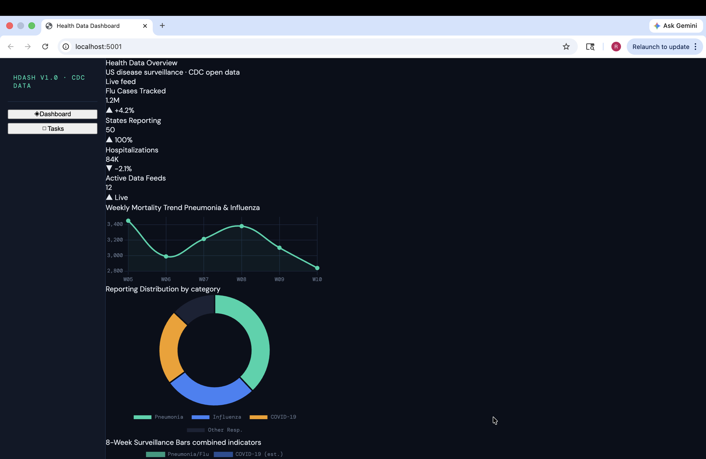

# Health Data Dashboard

> A full-stack web application that visualizes real-time US public health surveillance data alongside an integrated task management system — built to make health data actionable.



## Overview

This project pulls live disease surveillance data from the **CDC Open Data API** and displays it through an interactive dashboard with trend charts, summary statistics, and a breakdown by indicator. A built-in task manager lets users log and track follow-up actions directly tied to what they're seeing in the data.

Built as part of my Cybersecurity Engineering studies at NOVA (transferring to GMU), with a focus on secure backend architecture, clean REST API design, and practical data visualization.

## Features

- **Live CDC data** — fetches real respiratory disease surveillance data from CDC's open API
- **Interactive charts** — weekly trend line, indicator distribution doughnut, and 8-week comparison bar chart
- **Summary stat cards** — key metrics at a glance with trend indicators
- **Task manager** — full CRUD REST API for creating, updating, and deleting health-related tasks
- **Secure backend** — input validation and structured error handling

## Tech Stack

| Layer | Technology |
|---|---|
| Backend | Python 3, Flask |
| Data source | CDC Open Data API |
| Frontend | HTML, CSS, JavaScript |
| Charts | Chart.js |

## Getting Started

```bash
git clone https://github.com/RimOne3/health-data-dashboard.git
cd health-data-dashboard
pip install flask
python3 app.py
```

Open your browser at `http://localhost:5000`

## Why This Project

Axle Informatics works at the intersection of health data and technology — building systems that make complex biomedical data meaningful for federal clients. This project reflects that same goal.

## Contact

**Rim Targuisti** · [github.com/RimOne3](https://github.com/RimOne3) · Reston, Virginia
